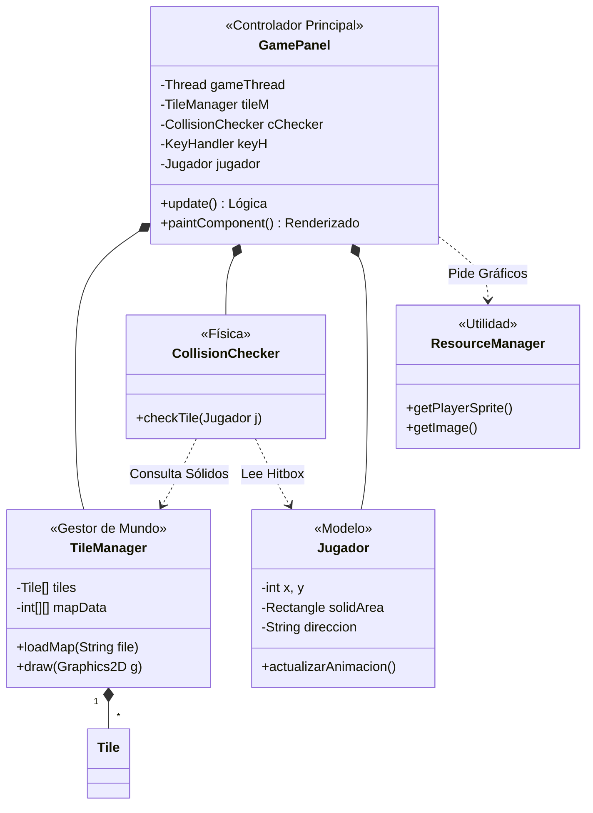

# Arquitectura de Clases - iLERNTALE MVP Alpha

Este documento describe la estructura técnica y las decisiones de diseño tomadas para el motor de juego de **iLERNTALE**. Seguimos un enfoque orientado a objetos y modular para facilitar la expansión del proyecto.

## 1. Diagrama de Arquitectura (UML)

## 2. Decisiones Técnicas Clave

### A. Motor de Tiles Basado en Texto (Data-Driven)
Hemos separado el diseño del nivel del código. El `TileManager` carga un archivo `.txt` donde cada número representa un tipo de terreno. Esto permite crear niveles sin recompilar el código Java.
*   **Tiles Implementados:** Suelo (0), Paredes (1), Ventanas (2), PC (3), Árbol (4), Taquilla (5).

### B. Sistema de Colisiones de Precisión (Hitbox)
Para un movimiento natural, el personaje no choca con "todo" su cuerpo. Usamos un **Solid Area (Hitbox)** situado únicamente en los pies del sprite.
*   **Lógica:** El `CollisionChecker` calcula en qué casilla del grid caerá el pie del jugador en el siguiente frame. Si esa casilla es "sólida", el movimiento se cancela.

### C. Game Loop y Animaciones
Mantenemos 60 actualizaciones por segundo (FPS) usando el sistema **Delta Time**. Las animaciones se gestionan mediante un contador de frames interno en la clase `Jugador`, alternando entre dos estados de caminata para dar dinamismo visual.

### D. Escalado Pixel-Art (x6)
Para que los sprites de 48px luzcan bien en resoluciones modernas, aplicamos un factor de escala constante. Todo el grid del juego se recalcula en base a `originalTileSize * scale`.

---
